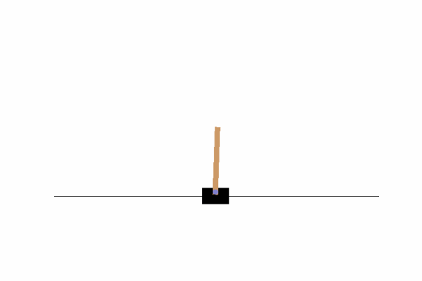

# REINFORCE_to_PPO_imp
My implementations of REINFORCE, A2C, PPO algorithms.

## REINFORCE
The REINFORCE algorithm is one of the earliest reinforcement learning algorithms. It uses gradient descent, the modern day algorithms are essentially descendants. We started here to understand the basics of gradient descent learning, to then iterate on to implement the other two. 

Our implementation is done in PyTorch and has been proven to work on basic gym environments, like CartPole. 

   

## A2C
This algorithm does not seem to be learning at the moment. Further debugging is necessary. 

## PPO
This algorithm is still being implemented.
